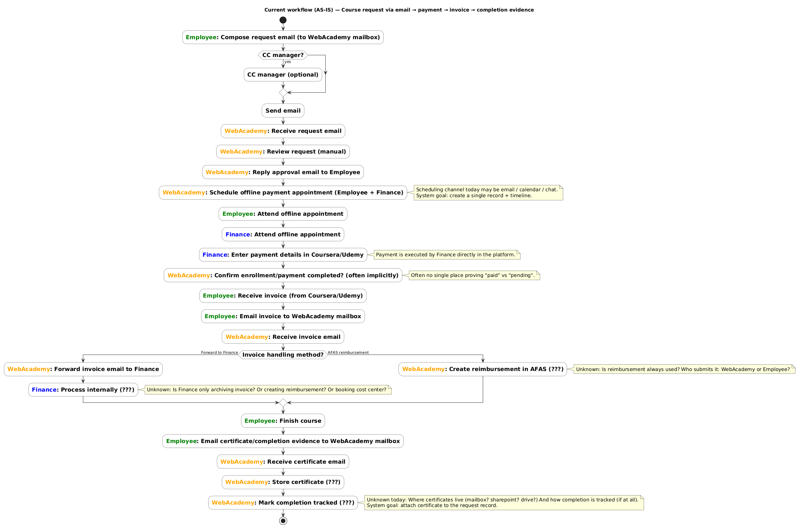
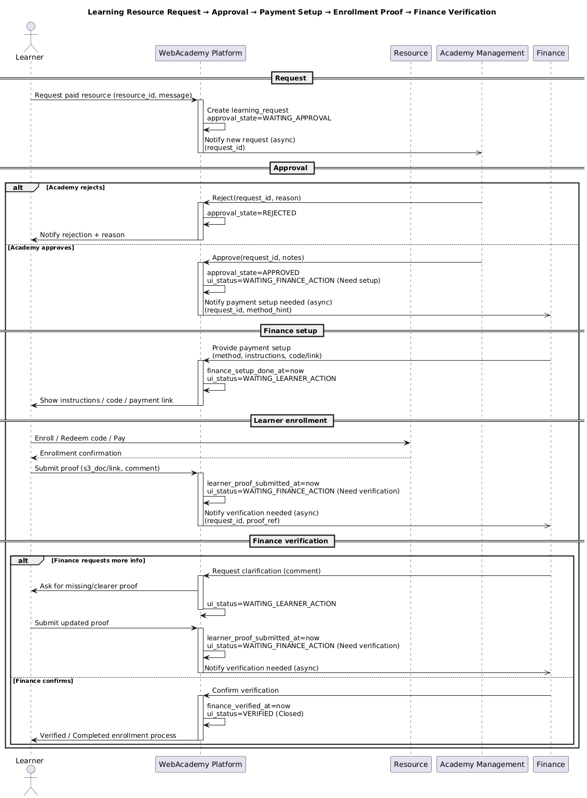

# outline
- [Problem Definition](#1-problem-definition)
- [Overall System Description](#2-overall-system-description)
- [Scope (v1) + Non-Goals (v1)](#3-scope-v1--non-goals-v1)
- [User Roles](#4-roles) 
- [Concepts](#5-concepts)
- [Personal Workspaces](#6-personal-workspaces)
- [Authentication & Operation](#7-authentication--operation)
- [Data Schema](#8-data-schema)
- [Frontend](#9-frontend)

# 1. Problem Definition

Today, employee learning requests are managed through email threads and offline coordination. Each request follows a similar path request, approval, payment setup, and completion proof but the details live across separate inboxes. As a result, there isn’t one place where you can see the complete history and current status of a request end to end.

### Current Workflow 

### Key Problems

1- No single source of truth: requests, approvals, payments, invoices, certificates, and follow-ups live in emails and personal folders.

2- Hard to track status: people cannot easily answer “where is this request now?” without chasing messages.

3- Weak traceability: completion proof (certificate) is not connected to the original request, so retrieving it later is painful.

4- Slow and repetitive work: the same information is requested and shared multiple times across Academy, Finance, managers, and employees.

5- Knowledge doesn’t spread: there is no centralized place for employees to share reusable learning paths (e.g., “DevOps Engineer”, “Test Engineer”) or share learnings/experiences from client work.

# 2. Overall System Description

WebAcademy is a web platform that centralizes two things in one place:

1) **Learning Request Lifecycle**: Employees request **paid or academy-managed learning resources**. The Academy reviews/approves the request, Finance confirms payment (invoice/payment), and the request remains trackable as a single record. Completion proof (e.g., certificate) must be attached to mark completion for paid resources and linked back to the original request.

2) **Learning Content Hub**: Employees and the Academy can discover and share structured learning content (resources and learning paths) so knowledge and experiences become reusable across employees.

The platform organizes learning content into two types:

- **Learning Resources**: single learning items such as courses, books, articles, projects, and videos.
- **Learning Tracks**: structured learning paths that group multiple resources into ordered levels (e.g., “DevOps Engineer”, “Test Engineer”). Tracks are for guidance and planning; **requests and payments apply only to individual resources**, not to tracks as a unit.

## 3. Scope (v1) + Non-Goals (v1)

### Scope (v1)

Version 1 focuses on:
- Automating the **Learning Request** process for **paid/academy-managed learning resources** to replace email-based coordination.
- Enabling employees and the Academy to **create and share learning content** (resources and tracks).
- Giving employees a centralized place to **track their learnings and activity** through dedicated workspaces.

### Non-Goals (v1)

Out of scope for v1:
- Comments and discussions
- Reviews and ratings
- Blogs / long-form articles
- Built-in notifications (in-app or email)

## 4. Roles

WebAcademy platform has three roles:
- **Employee**
- **Academy**
- **Finance**

### Base Capabilities (applies to all roles)
- Browse published **Learning Tracks** and **Learning Resources**
- Search and filter content
- View content details
- Share links to content

---

### Employee
An Employee has all Base Capabilities, plus:
- Manage **My Learnings** (Saved / In Progress / Completed / Dropped)
- Create and manage **Learning Requests** for **paid/academy-managed resources only**
- Track their requests in **My Requests**
- Create and edit their own **draft** learning content (resources/tracks)
- Submit their content for review and track it in **My Submissions**

---

### Academy
The Academy has all Base Capabilities, plus:
- Review and process employee **Learning Requests** (approve / decline)
- Review user **Submissions** (resources/tracks) and decide: publish / decline
- Create, edit, and publish Academy-owned learning content

---

### Finance
Finance has all Base Capabilities, plus:
- View approved **Learning Requests** that require payment handling
- Provide and manage **payment setup** for a request (e.g., gift code / virtual card)
- Record/confirm payment-related proof linked to a request

## 5. Concepts

### User
A person who uses WebAcademy. Every user has exactly one role that defines what they can do:

- **Employee**: browses content, saves tracks/resources to *My Learnings*, requests paid resources, follows up their requests, and shares learnings/feedback.
- **Academy**: curates and publishes content, reviews learning requests, and communicates outcomes to employees.
- **Finance**: provides payment setup for approved learning requests andconfirms payment status for approved learning requests (based on invoice/payment evidence).

> Note: a **Manager/Approver** role may be introduced later as an optional approval step before the Academy review.

### Learning Resource
A single learning item (e.g., course, book, article, project, video).  
A resource may be **free** or **paid/academy-managed**.

### Learning Track
A curated learning path that groups multiple resources into ordered levels.  
Tracks are for guidance and planning. **Tracks are not paid or requested as a unit.**

### Skill
A standardized label that describes what a resource or track teaches (e.g., “Docker”, “Kubernetes”, “Testing”, “SQL”).

Skills exist to improve search and discovery (find learning by skill).
A resource/track can have multiple skills. Skills can be selected from existing ones and (optionally) new skills can be proposed.

### Learning Request
A traceable record created to request **a single paid/academy-managed resource**.  
It links the employee, the target resource, academy review, finance confirmation, and any related attachments (e.g., invoice, certificate) when applicable.

### Notification
A message delivered to a user to inform them that something relevant happened or that they need to take action.

Notifications are used to reduce back-and-forth emails and to make the system “self-driving” (users know what’s next without asking).

Examples:
- Employee: “Your request for *{Resource}* was approved by Academy.”
- Academy: “New learning request submitted by *{Employee}*.”
- Finance: “Invoice uploaded for request *{X}*. payment confirmation needed.”
- Employee: “Finance confirmed payment for *{Resource}*.”

### Submission
A record representing user-created content (resource or track) going through the publishing workflow: Draft → Under Review → Published / Declined.

### My Learning Item
An entry in an employee’s personal learning space representing a resource or track they saved or are actively learning, with progress status (Saved / In Progress / Completed / Dropped).

### Evidence / Certificate (optional)
A file or link that proves completion of a learning resource (e.g., certificate).  
Evidence can be attached to the learning item and/or linked to the original learning request when applicable.

### Review
A rating and/or comment on a published resource or track to help others judge quality.

## 6. Personal Workspaces

The platform provides three distinct user workspaces. Each workspace represents a different concept and has its own statuses.  
A single item may appear in more than one workspace, but **each workspace remains the source of truth for its own concept**.

### 1) My Requests (Learning Requests)
Covers the employee’s **paid / academy-managed resource requests** end-to-end.

- Scope: **requests for individual resources only** (not tracks).
- Purpose: visibility on the request lifecycle across **Academy** and **Finance**.

The lifecycle is illustrated in the sequence diagram:

#### Statuses

A **Learning Request** is always in exactly one status.  
Statuses are designed to reflect the **next actor / blocker** (what needs to happen next).

**Status Enum**
- **WAITING_ACADEMY_APPROVAL**
  - Meaning: request submitted; Academy must approve or reject.
  - Next actor: Academy

- **REJECTED**
  - Meaning: Academy rejected the request (with reason).
  - Next actor: None (terminal)

- **WAITING_FINANCE_SETUP**
  - Meaning: Academy approved; Finance must provide a payment setup (gift code / virtual card instructions).
  - Next actor: Finance

- **WAITING_LEARNER_ACTION**
  - Meaning: Finance provided payment setup **or** Finance requested clarification; learner must act (redeem/pay and/or upload missing/clearer proof).
  - Next actor: Employee

- **WAITING_FINANCE_VERIFICATION**
  - Meaning: learner submitted proof; Finance must verify/confirm.
  - Next actor: Finance

- **VERIFIED**
  - Meaning: Finance confirmed verification; request is closed.
  - Next actor: None (terminal)

**Allowed Transitions (high level)**
- WAITING_ACADEMY_APPROVAL → REJECTED
- WAITING_ACADEMY_APPROVAL → WAITING_FINANCE_SETUP
- WAITING_FINANCE_SETUP → WAITING_LEARNER_ACTION
- WAITING_LEARNER_ACTION → WAITING_FINANCE_VERIFICATION
- WAITING_FINANCE_VERIFICATION → WAITING_LEARNER_ACTION *(if Finance requests more info)*
- WAITING_FINANCE_VERIFICATION → VERIFIED

### 2) My Submissions (Content Publishing Workflow)
Covers learning content a user **created** (resources or tracks) and its publishing state.

- Scope: user-authored resources and tracks.
- Purpose: manage drafts and follow the publishing outcome.

#### Statuses
- **Draft**: private to the creator; not visible to others.
- **Under Review**: submitted for Academy review; not publicly visible.
- **Published**: visible in the content hub.
- **Declined**: not published; includes a reason/feedback.

#### Publishing Rules
- **Employee-created content**
  - Starts as **Draft**.
  - When submitted, moves to **Under Review**.
  - Academy decides: **Published** or **Declined**.

- **Academy-created content**
  - Can be **Published directly** (no review required).

- **Academy feedback / changes**
  - Academy does **not edit employee content directly**.
  - If changes are needed, Academy returns the submission to the creator (still not published) with feedback, and the creator resubmits for review.

### 3) My Learnings (Personal Learning Progress)
covers what the user plans to learn or is learning, independent of the request workflow.

- Scope: saved resources + saved tracks, and progress per item.
- Purpose: personal learning backlog + progress tracking.
- Statuses:
  - Saved
  - In Progress
  - Completed
  - Dropped

## 7. Authentication & Operation

### Authentication
- WebAcademy supports two sign-in modes:
  - **Company SSO** for active employees. [Authentication Diagram](./diagrams/authentication.png)
  - **Alumni email + password** for users after they leave the company.
- Alumni email must be **different from the company email**.
- Employees can set up alumni access **before leaving** from within the platform, so they can continue access after their company account is deactivated.

### Access Control
- What a user can see and do is driven by:
  - **User status**: Employee / Alumni / Disabled
  - **User role**: Employee / Academy / Finance
- Academy can disable a user’s access when needed (misuse/policy).

### Operations Ownership
- Only a small subset of Academy and Finance users operate the workflows.
- Each of Academy and Finance has:
  - a **Primary operator** (main responsible person)
  - a **Delegate operator** (backup)
- The platform supports switching Primary/Delegate (e.g., vacation or absence).

### Reminders
- The platform sends **email reminders** to the **Primary operator** to avoid noisy “notify everyone” 

## 8. Data Schema

This document [docs/data_schema.md](./data_schema.md) defines the data model for the backend.  

## 9. Frontend

[WebAcademy Figma Design](https://stem-pasta-86734200.figma.site/)
